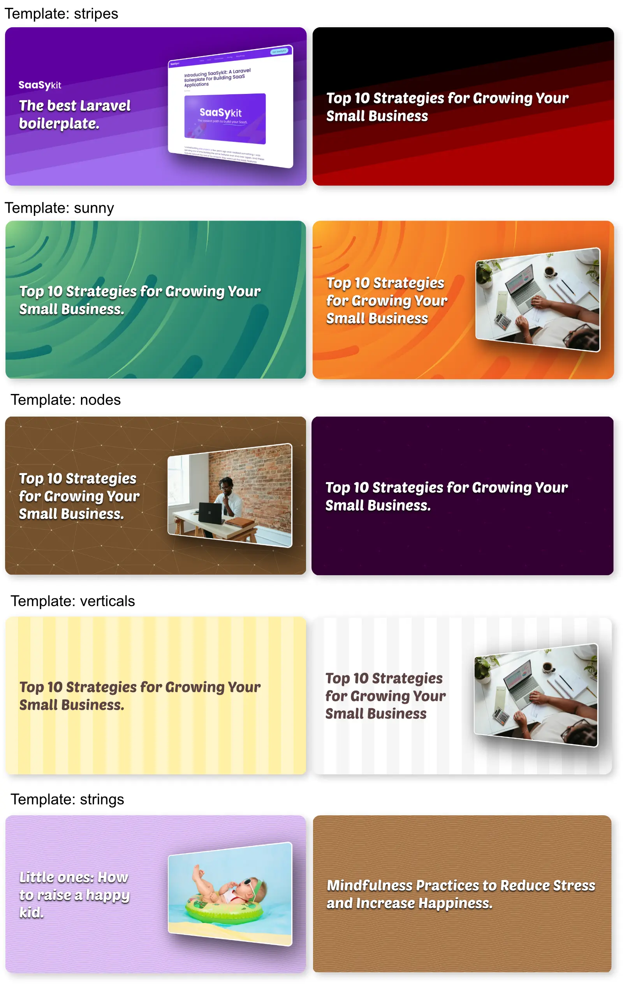
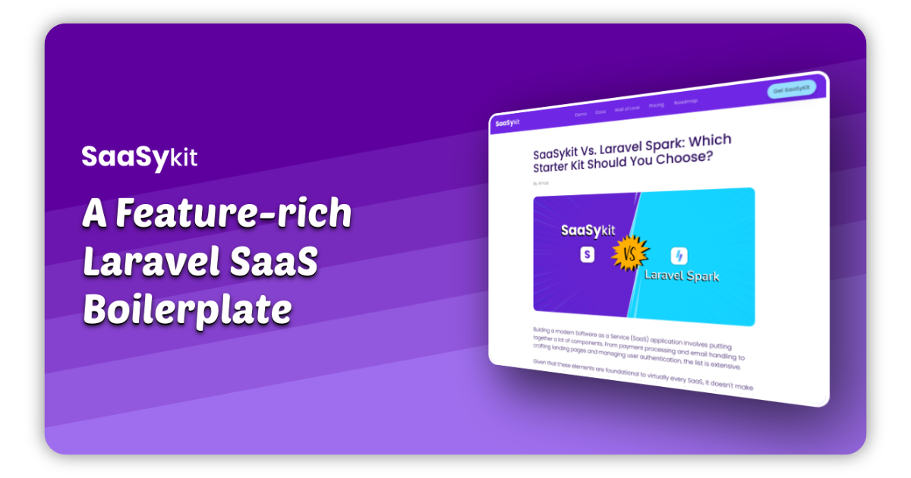

<p align="center"></p>

<p align="center">
<a href="https://packagist.org/packages/saasykit/laravel-open-graphy"></a>
</p>

**Open Graphy** is an awesome open graph image (social / twitter / X cards) generator package for your Laravel applications.

With Open Graphy, you can generate social cards for your website dynamically. You can use the default template or create your own template.

**Features:**

- Easily generate open graph images for your website.
- Add title, an image and your logo to the open graph image. 
- Add a screenshot of the page inside the open graph image to show the preview of the page. 
- 5 different templates to choose from.
- Customize the colors and styles of the templates.
- Cache the generated images.
- Create your own template if you want.

**Examples: 👇** 



## Requirements
- PHP 8.1+

## Installation

1. You need to install the `chromium` or `chrome` browser on your server as it's being used by Open Graphy to render images. 

**Ubuntu/Debian**:
```bash
sudo apt-get install -y chromium-browser
```

**MacOS**:
```bash
brew install --cask google-chrome
```

**Laravel Sail using MacOS (Apple Silicon)**:
I found the following steps to work for me on my M1 Macbook Pro:

```bash
apt-get install software-properties-common
add-apt-repository ppa:xtradeb/apps -y
apt update
apt install chromium
```

2. Once done, You can install the package via composer:

```bash
composer require saasykit/laravel-open-graphy
```

You can publish the config file with:

```bash
php artisan vendor:publish --tag="open-graphy-config"
```

This is the contents of the published config file:

```php
<?php

// config for SaaSykit/OpenGraphy
return [
    'chrome_binary' => null, // leave empty for autodiscovery, or set it to 'chrome' or 'chromium' depending on the binary you want to use. You can also provide full path to the binary
    'open_graph_image' => [  // final generated open graph image settings
        'width' => 1200,
        'height' => 630,
        'type' => 'png',  // png or jpg
    ],

    'image' => null,  // path (relative to public directory) or url to the image to be added to the open graph image
    
    'fallback_open_graph_image' => null,  // path (relative to public directory) or url to the image to be used as a fallback if the open graph image cannot be generated

    'logo' => [
        'enabled' => false, // set to false to disable the logo
        'location' => '', // path (relative to public directory) or url to the logo to be added to the open graph image
    ],

    'render_timeout' => 10000, // maximum time to wait for the screenshot to render before failing

    'screenshot' => [
        'enabled' => false,  // set to true to add a screenshot of the page into the open graph image
        'render_width' => 1100,
        'render_height' => 1000,
    ],

    // The cache location to use to store the generated images.
    'storage' => [
        'disk' => 'public',
        'path' => 'open-graphy',
    ],

    'template' => 'verticals',

    'template_settings' => [
        'strings' => [
            'background' => '#5e009e',
            'stroke_color' => '#9f6eee',
            'stroke_width' => '2',
            'text_color' => '#ffffff',
        ],
        'stripes' => [
            'start_color' => '#5e009e',
            'end_color' => '#9f6eee',
            'text_color' => '#ffffff',
        ],
        'sunny' => [
            'start_color' => '#5e009e',
            'end_color' => '#9f6eee',
            'text_color' => '#ffffff',
        ],
        'verticals' => [
            'start_color' => '#FFFFFF',
            'mid_color' => '#F5F5F5',
            'end_color' => '#CCCCCC',
            'text_color' => '#5B4242',
        ],
        'nodes' => [
            'background' => '#330033',
            'node_color' => '#550055',
            'edge_color' => '#440044',
            'text_color' => '#ffffff',
        ],
    ],
];

```

**Configuration options:**

- `chrome_binary`: Based on the browser you installed, you can set the `chrome_binary` to either `chrome` or `chromium`. You can also leave it set as null to allow auto discovery of the binary. You can also provide the full path to the binary.
- `open_graph_image`: The settings for the final generated open graph image.
- `image`: The path (relative to the public directory) or URL to the image to be added to the open graph image.
- `fallback_open_graph_image`: The path (relative to the public directory) or URL to the image to be used as a fallback if the open graph image cannot be generated.
- `logo`: The settings for the logo to be added to the open graph image.
- `render_timeout`: The maximum time to wait for the screenshot to render before failing.
- `screenshot`: The settings for the screenshot to be added to the open graph image.
- `storage`: The cache location to use to store the generated images.
- `template`: The template to use for the open graph image.
- `template_settings`: The settings for the templates included in the package.


The configs above allow you to edit the colors and styling of the provided templates, but if you prefer to go god mode and edit styles or introduce new templates, you can publish the views using the following command:

```bash
php artisan vendor:publish --tag="open-graphy-views"
```

See below for [Creating a custom template](#creating-a-custom-template) for more details.

## Usage

All what you need to do is to call the following component in your `<head>` tag in your blade file:

```bladehtml
<x-open-graphy::links title="This is an awesome title"/>
```

This component accepts the following parameters:
- `title`: The title to be displayed on the open graph image. (required)
- `image`: The image (path from public directory or a URL) to be displayed on the open graph image. (optional)
- `template`: The template to use for the open graph image. You can choose from `background`, `stripes`, `sunny`, `verticals`, `nodes` (optional).
- `screenshot`: Set to `true` to add a screenshot of the page to the open graph image, will override the `screenshot.enabled` setting in the config file. (optional) See [Website screenshot](#website-screenshot) for more details.
- `logo`: Set to `true` to add a logo to the open graph image, will override the `logo.enabled` setting in the config file. (optional)


Calling the `x-open-graphy::links` component will generate the following meta tags in your HTML:

```html
<meta property="og:image" content="{URL}">
<meta property="og:image:type" content="image/png">
<meta property="og:image:width" content="1200">
<meta property="og:image:height" content="630">

<meta name="twitter:card" content="summary_large_image">
<meta name="twitter:image" content="{URL}">
```

### Figuring out your best design:
Open Graphy comes with a testing route (only available for local environment) that you can use to test the different templates and settings. You can access the route by visiting `/open-graphy/test` in your browser.

It accepts the following query parameters:
- `title`: The title to be displayed on the open graph image.
- `image`: The image to be displayed on the open graph image (optional).
- `template`: The template to use for the open graph image. You can choose from `background`, `stripes`, `sunny`, `verticals`, `nodes` (optional).

You would typically need to edit the settings in the config file to change the colors and styles of the templates, and keep testing until you find the best design for your website.

### Website Screenshots:

You can also add a screenshot of the page to the open graph image. This is useful if you want to show a preview of the page in the open graph image. To enable this feature, set the `screenshot.enabled` to `true` in the config file.

**Example:**

<p align="center">
    <a href="https://saasykit.com?ref=opengraphy" target="_blank">
    
    </a>
</p>


**Important 1**: this feature works only if the page is accessible from the internet where the package is installed. What happens is that the package will open the page in a headless browser, take a screenshot of the page and add it to the open graph image. This will **NOT work on a Laravel sail installation** unless do you do some magic.

**Important 2**: most of the time screenshotting works fine, but sometimes longer pages or ones that have more heavy effects will timout. You can increase the `render_timeout` in the config file to allow more time for the screenshot to render, but Open Graphy will fail gracefully if the screenshot could not be taken, and will still generate the open graph image without the screenshot.

### Clearing the cache:
You can clear the cache of the generated images using the following command:

```bash
php artisan open-graphy:clear
```

### Creating a custom template:

To create a custom template, you need to publish the views (if you haven't already) using the following command:

```bash
php artisan vendor:publish --tag="open-graphy-views"
```

Now you can create a new blade file in the `resources/views/vendor/open-graphy/templates` directory. The file should contain the HTML and CSS for the template. You can get some inspiration from the existing templates in the package.

Once you have created the template, you can set the `template` key in the config file to the name of the template file (without the `.blade.php` extension). For example, if you created a file called `custom.blade.php`, you would set the `template` key to `custom`.

You can use the following pattern library if you're looking for cool ones: https://www.svgbackgrounds.com/set/free-svg-backgrounds-and-patterns/ 

## Wanna build a Laravel SaaS application quickly?

If you want to build a SaaS app quickly, support us by checking out [SaaSykit](https://saasykit.com?ref=opengraphy). It's a SaaS starter kit (boilerplate) that comes packed with all components required to run a modern SaaS software.

## Contributing

Please see [CONTRIBUTING](CONTRIBUTING.md) for details.

## Security Vulnerabilities

Please review [our security policy](../../security/policy) on how to report security vulnerabilities.

## Credits

- [Ahmad Mas](https://github.com/aswilam)
- https://www.svgbackgrounds.com/set/free-svg-backgrounds-and-patterns/ for the patterns.

## License

The MIT License (MIT). Please see [License File](LICENSE.md) for more information.
